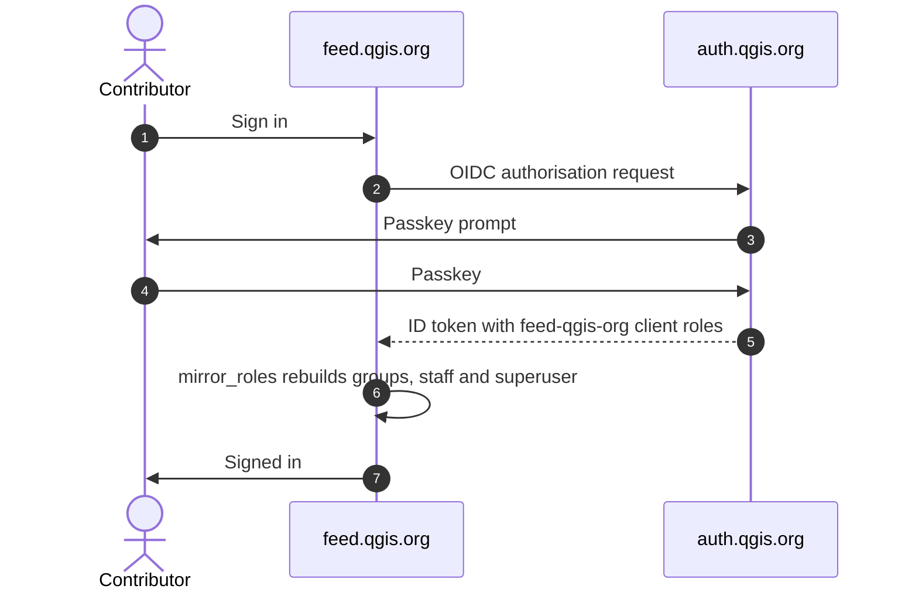
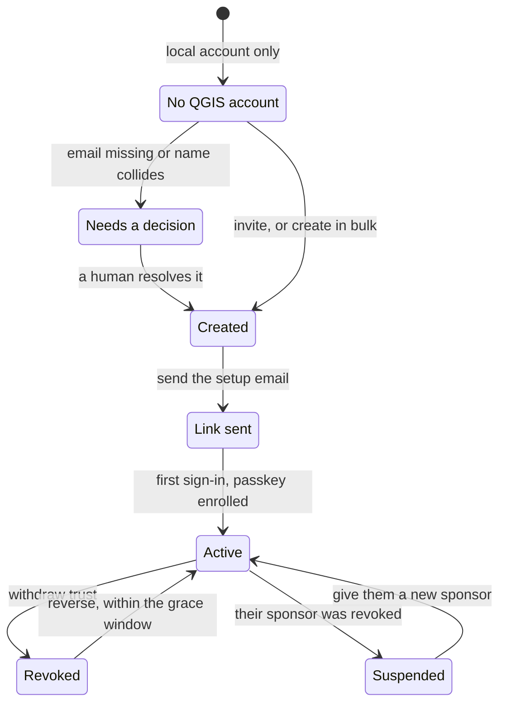
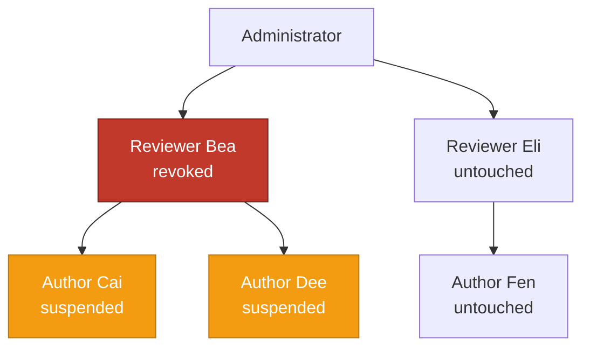

# Single sign-on with auth.qgis.org

This page is for the people who run and maintain the feed site. It covers how
accounts reach the site, who may invite whom, and how to withdraw trust.

If you are a contributor rather than a maintainer, read the guide at
`/sso/help/` instead. It explains how to get an account, set up a passkey,
invite somebody, and what to do when you cannot sign in. That guide lives
inside the site so that it always matches what is deployed, and anybody can
read it while signed out. Update it in the same change as the code:
`qgisfeedproject/templates/qgis_sso/help.html`.

The [design notes](sso-design.md) explain why each rule exists. Read them
before you change any of this.

## How a sign-in works

Keycloak owns the account and the credential. This site keeps a link to the
realm subject and a cached copy of what the roles mean here.

Step 7 is the one to remember. Django groups and the staff and superuser flags
are a copy of the Keycloak client roles, and we rebuild that copy in full at
every sign-in. Add a role in Keycloak and the person gains it here. Remove it
there and they lose it here.

> **Edit roles in Keycloak, on the `feed-qgis-org` client, never in Django
> admin.** If you change the checkboxes in `/admin/` on an account linked to
> the realm, it looks like it worked, and the next sign-in quietly undoes it.

## What each role grants

`SSO_ROLE_MAP` in `settings.py` holds the mapping. The mirroring only ever
touches the groups named in `SSO_MANAGED_GROUPS`, so a group you created by
hand for something else survives a sign-in.

| Keycloak client role | Django groups | staff | superuser |
|---|---|---|---|
| `admin` | authors, approver | ✅ | ✅ |
| `web-maintainer` | authors, approver | ✅ | ✅ |
| `reviewer` | authors, approver | ✅ | |
| `usergroup-author` | authors | ✅ | |
| `author` | authors | ✅ | |

## The enrolment page

Anybody with a realm account can open `/sso/manage/`, and each person sees only
what they are entitled to see. A superuser sees every account that has a
Keycloak identity. Everybody else sees the accounts they vouched for. The page
shows ten rows at a time, and you can filter by state or search by name.

Every button on a row acts on that row alone. If the account sits outside your
own branch of the tree, the action is refused, whether or not the listing
happened to show it.

| Action | What it does |
|---|---|
| Send email | Sends the account-setup email, after one confirmation. It reaches a real contributor and you cannot unsend it. |
| Get the link | Shows the setup link on a page of its own. See [Handing over a link](#handing-over-a-link). |
| Withdraw trust | Opens `/sso/manage/revoke/<id>/`. See [Withdrawing trust](#withdrawing-trust). |
| New sponsor | Opens `/sso/manage/reparent/<id>/`. See [Rescuing a suspended account](#rescuing-a-suspended-account). |

Some accounts cannot be invited at all, because they have no email address or
somebody deactivated them. The page leaves those out and counts them in a line
under the table. Deal with them in the admin user list, using its **SSO
account** filter. Dormant accounts and accounts that have never been used do
appear, with the flag shown beside them.

## Invitations

Somebody with quota brings in somebody they know, and the new account records
for good who vouched for it. This is the first part of the
[web of trust](../SSO-Web-Of-Trust.md). The **Invite** menu offers two routes:

- **New user.** Anyone whose roles carry quota can use this. You fill in a
  short form, and we create the account straight away both here and in the
  realm. Nothing reaches the person until you send it.
- **Existing user.** Superusers only, because it reaches the whole user list.
  It takes an account that already exists here and gives it a place in the
  realm.

Who may offer what is the ladder in `SSO_ROLE_TIERS`, with quotas in
`SSO_TIER_QUOTAS`.

| Tier | Role | May offer | Open places |
|---|---|---|---|
| 0 | `admin` | anything | unlimited |
| 1 | `web-maintainer` | tier 1 and below | 25 |
| 2 | `reviewer` | tier 2 and below | 10 |
| 3 | `usergroup-author` | tier 3 and below | 10 |
| 4 | `author` | `author` only | 3 |

Somebody who holds two roles gets the more privileged tier and the *larger* of
the two allowances, never the sum of them. Every account you invited that has
not signed in yet holds one of your places, and that place comes back to you
when they do sign in. The username and the address must both be free here and
in the realm.

### Linking to an account that already exists in the realm

The realm is shared with hub and plugins, so a long-standing contributor here
very likely has a QGIS account already. For those accounts *Invite existing
user* shows a third outcome, **will be linked**, and names the QGIS account it
matched. We create nothing in the realm, and linking grants no privilege the
account did not already hold here.

We match on one thing only: an exact address that Keycloak reports as verified.
Three cases are refused, and the page names which one it hit. The address
differs, the realm has not verified it, or the realm account already belongs to
somebody here. One run links up to `SSO_ADMIN_ACTION_MAX_USERS` accounts (25).

## Withdrawing trust

One action has two outcomes. The person you act on is **revoked**. Everybody
they vouched for is **suspended**, which is deliberately lighter, because those
people have done nothing wrong.

| | Revoked | Suspended |
|---|---|---|
| Client roles | removed, recorded first | reconciled to nothing at sign-in |
| Realm account | disabled at `auth.qgis.org` | untouched |
| Local account | deactivated | active, with a banner explaining why |
| Can sign in | no | yes, with no permissions |

Who may act:

- You can act anywhere in your own part of the tree and nowhere else. Never on
  somebody above you, never across into another branch. This holds for
  administrators as well.
- No administrator can revoke another administrator. Take the `admin` role off
  them in Keycloak first, then revoke.
- Standing down voluntarily is not built yet. It would move the people below
  somebody to a new sponsor rather than suspend them, so it is not this button.

Opening `/sso/manage/revoke/<id>/` changes nothing, so you can read the page
and leave it. It asks you for a reason, which goes into the audit trail, and it
names every person the revocation would reach.

You can reverse a revocation for `SSO_REVOCATION_GRACE_DAYS` (7). One action
puts the recorded roles back, re-enables the realm account, and clears the
suspension for everybody below them. After that the record stays but the button
goes. Anybody suspended by a *different* revocation is left alone.

We keep the person's content. `SSO_ON_REVOKE` points at
`qgisfeed.trust.on_revoke`, which sends entries in *pending review* or
*approved* back to *draft*. Published entries stay published, and we delete
nothing and re-attribute nothing.

### Rescuing a suspended account

The person who caused a suspension is rarely the person you want back. When a
maintainer leaves, everyone they invited is suspended, and reversing the
revocation to clear it re-enables the account you meant to remove.

Give the account a new sponsor instead, at `/sso/manage/reparent/<id>/`, which
you reach from the row. The page asks for a reason and names everybody it
brings back. It reactivates the account, and anybody the same revocation
suspended below it, while the person you actually revoked stays revoked. Only
administrators and web maintainers can do this.

The picker lists only people who qualify as a sponsor. They have to be active,
senior enough to have invited the account in the first place, and outside the
account's own part of the tree. The grace window does not apply here, so this
route stays open long after reversal has expired.

## Handing over a link

Sometimes you have somebody on a call and their email is not arriving. *Get
the link* on their row takes you to `/sso/manage/link/`, a page that shows that
one link and nothing else. Inviting a new user brings you to the same page. We
never store the link and never log it, and the page takes it out of the session
as it renders, so a reload asks you to issue a fresh one.

Under the link is a QR code of the same thing. The person can scan it straight
onto the device their passkey will live on, instead of reading a long token out
to you. It is the same credential in another shape, so hand it over with the
same care.

This works only for accounts that have not signed in yet. The button disappears
after the first sign-in, and the view refuses the request in any case, because
by then the link would sign the person in without asking for a passkey. If
somebody has lost every device, use *Send email* instead. It is the same link,
delivered to their own address rather than to the administrator who asked for
it.

The button needs an extension in Keycloak. It depends on PhaseTwo's
[magic-link extension](https://github.com/p2-inc/keycloak-magic-link) deployed
into `/opt/keycloak/providers/`. Without it the button reports a 404, and the
identity's detail page links to the Keycloak admin console instead. There you
can see the state of the person's credentials and retry the send, which uses
Keycloak's own SMTP settings rather than Django's.

> ⚠ **Verify a link end to end on a throwaway realm before relying on this.**
> A magic link signs the person in, so if the required actions do not fire they
> land signed in with no passkey, which is worse than the email path.

## Passkeys and the profile page

Your own page is at `/sso/profile/`, reached from the username in the header.
It shows your username and address, the groups your Keycloak roles have
granted you, and your passkeys with the date each one was enrolled.

Adding or removing a passkey happens at `auth.qgis.org`, and it has to.
*Add a passkey* starts an ordinary sign-in that asks Keycloak to run the
enrolment, then brings you back to the profile page. This site never changes a
credential itself, and it refuses to remove your last passkey, because that
would lock you out with no way back. Enrol the replacement first.

If an account has no realm identity, it still gets the page, and we tell it
there are no passkeys to manage. *Everything else, at auth.qgis.org* links to
the full account console.

## Migrating a wave in the admin

The enrolment page works one row at a time. To move a whole wave of people, use
the Django admin: filter the changelist, select the accounts, then run an
action. Both routes call the same code, so the rules and the wording match
wherever you start. All four actions are superuser only and audited, and each
one does a single thing, so no step happens as a side effect of another.

| Where | Action | What it does |
|---|---|---|
| Users | Export the migration report | Downloads a CSV and changes nothing. |
| Users | Create the Keycloak account | Creates realm accounts and sends no email. |
| Keycloak identities | Send the account-setup email | Invites them, and you can run it again. |
| Keycloak identities | Disable the local Django password | Retires the password fallback, near the end of a migration. |

**1. Read the report first.** The CSV tells you the Keycloak username and the
client roles each account would get. It also flags the accounts that need a
person to decide: names that collide once they are lowercased, duplicate or
missing email addresses, and accounts that are dormant or have never been used.
Keep the file as your record of the migration.

**2. Create the accounts.** A confirmation page lists the outcome for each
person before we write anything, and that page is the only preview you get. We
hold the flagged accounts back unless you tick the box. One run creates up to
`SSO_ADMIN_ACTION_MAX_USERS` accounts (25), so migrate in waves.

**3. Send the setup email.** A link lasts 14 days, and these accounts have no
password to fall back on, so send it again whenever somebody misses the window
or loses every device. We count each send on the identity record.

> ⚠ **Staging can email real contributors.** The staging database is restored
> from production and holds every contributor's real address, and the staging
> realm uses the real Resend credential and can send from `noreply@qgis.org`.
> Check who you have selected. A setup link cannot be unsent.

Announce the migration on the mailing list before the first email goes out, and
name the exact address it will come from. An account-setup email nobody expects
reads as phishing.

**4. Disable local passwords.** This is mostly automatic, because we retire a
password the moment that account first signs in through Keycloak. The action
only touches accounts with a recorded successful SSO login, and it reports the
rest and leaves them alone. Use it to catch up accounts that signed in before
this became automatic, and to check where a batch stands.

## Retiring local login

The user list has an **SSO account** filter. Use it together with the *last
login* filter to answer the question this decision rests on: which accounts are
still in use but have nobody behind them in the realm yet. We record every
local-password sign-in as an audit event, so filter **SSO audit events** by
action to count how many are left.

> ⚠ **Do not set `LOCAL_LOGIN_ENABLED = False` until break-glass access exists
> and has been tested.** Without a documented, audited, shell-only emergency
> path, a Keycloak outage locks out every administrator, including the ones who
> would fix Keycloak.

## Settings reference

| Setting | Meaning |
|---|---|
| `LOCAL_LOGIN_ENABLED` | One flag, three effects: the `ModelBackend` entry, the password form on the login page, and what `/admin/login/` accepts. |
| `SSO_MIGRATION_LINKING` | Binds a token to a pre-existing local account on an exact username **and** verified-email match. Off by default, on only during the cutover window. |
| `OIDC_CREATE_USER` | Must stay `False`. The realm is LDAP-federatable, so auto-creation would grant feed accounts to the whole OSGeo directory. |
| `OIDC_RP_CLIENT_SECRET` | Confidential client secret. Goes in `settings_local`, **never** in the process environment. |
| `SSO_PROVISIONER_CLIENT_SECRET` | Service-account secret used by provisioning. Same rule. The web client must never hold `manage-users`. |
| `SSO_REQUIRED_ACTIONS` | What Keycloak makes a new user complete. `VERIFY_EMAIL` and `webauthn-register-passwordless` mean a passkey and nothing else, so no password or TOTP secret is ever created. |
| `SSO_RETIRE_PASSWORD_ON_LOGIN` | Retires the local password at the first SSO sign-in. `False` keeps both doors open during a cutover. |
| `SSO_ADMIN_ACTION_MAX_USERS` | Accounts one request will provision (25). |
| `SSO_SETUP_REDIRECT_URI` | Where Keycloak returns somebody who has finished setting up. Points at `/oidc/authenticate/` so they arrive signed in, and **must be registered as a valid redirect URI on the `feed-qgis-org` client**. |
| `SSO_REVOCATION_GRACE_DAYS` | How long a revocation can be undone in one action (7). |
| `SSO_MAGIC_LINK_URL` | Derived from `QGIS_AUTH_URL`, like the OIDC endpoints. Answered by PhaseTwo's magic-link extension. |

---

Made with 💗 by [Kartoza](https://kartoza.com) |
[Donate!](https://github.com/sponsors/kartoza) |
[GitHub](https://github.com/qgis/QGIS-Feed-Website)
